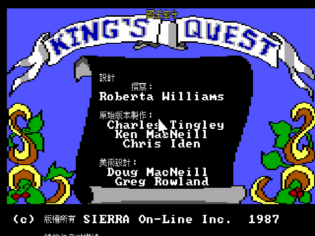
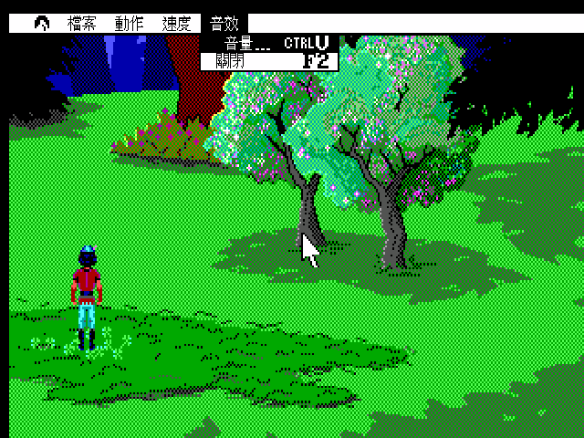
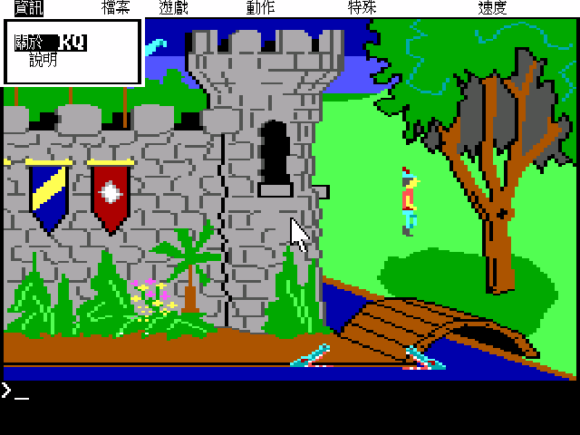
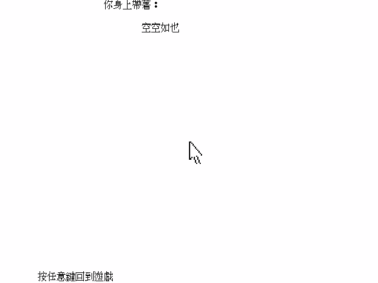

# 國王密令 King's Quest I — 繁體中文化

你站在王城外的橋上，身上什麼也沒有。老國王把你叫來，交代了三件事：一面能預見未來的
**魔鏡**、一面讓王國戰無不勝的**靈盾**、一個永遠裝滿金幣的**金盒子**——全被騙走或偷走了。
你要去把它們找回來。做到了，王位是你的；做不到，戴凡確王國撐不過下一場外患。

國王沒說的是，路上有噴火的巨龍、騎掃把的巫婆、會把你拖進地下宮殿的地穴人，
還有一座走進去就繞不出來的迷宮。而全國最驍勇的騎士——也就是你——出發時連把劍都沒有。

這個專案把兩個 DOS 版本的每一句話都翻成繁體中文：對白、道具名、選單、狀態列，
合計 3018 則。譯名照當年那本中文說明書，主角叫**格拉漢爵士**，國度叫**戴凡確王國**。

這裡只有中文化過的引擎與譯文，**不含遊戲本體**。想直接玩，跳到 [〈安裝〉](#安裝)。

| 重製版 | 原版 |
|---|---|
|  |  |
| 中文標題疊在原版 logo 上方，一個像素都沒動到原始美術 | 連工作人員名單都是中文 |

**[▶ 宣傳影片（54 秒）](https://youtu.be/MqZ9T2CwFdo)** — 兩版的標題、對白、選單、狀態列與
遊戲清單，左英文原版／右繁體中文並排對照，配樂是遊戲原版的 MT-32 音樂。

---

## 故事：三件寶物是怎麼弄丟的

遊戲一開始，你就站在王城外的橋上，身上什麼也沒有。國王要你去把三件寶物找回來——
但它們為什麼會弄丟，遊戲裡不會告訴你。那段故事在說明書裡，當年的玩家是把盒子拆開、
邊等磁片讀取邊讀完的。

很久以前，猛獸與蠻族還橫行於世的年代，唯獨愛德華國王統治的戴凡確王國一片富庶。
國王與皇后卻始終沒有孩子。

一個清晨，一位法術高強的**巫師**出現在花園裡，說他可以施法帶來一位孩子，
代價是那面**魔鏡**——那面能預見未來、也是王國富庶根源的鏡子。國王與皇后在鏡中隱約看見
一位頭戴金冠、如王子般的年輕人，以為那就是自己未來的兒子，便高高興興地把鏡子給了他。
巫師帶著魔鏡回到住所，派最兇猛的野獸看守。

孩子沒有來。沒有魔鏡的王國，遭遇四百年來第一次提早到來的秋季暴雨，一年的收成全毀。
飢荒帶來瘟疫，皇后也倒下了。

第四天，一個**小矮人**走進皇宮，說他跋涉萬里帶來只有矮人族才知道的神奇樹根，能治百病。
他用樹根碰了碰皇后的嘴唇，皇后立刻睜開眼睛對國王微笑。國王問他要什麼，
他要的是**靈盾**——五百年來讓戴凡確王國刀槍不入、戰無不勝的那面盾。國王交出去了。
皇后吃下樹根後日漸衰弱，終於還是走了。教堂敲起喪鐘；而失去靈盾的消息傳開後，
外患再也沒有斷過。

又過了幾年，孤獨的國王在野外從狼群裡救下一位年輕小姐，她自稱是**肯伯倫王國**的公主。
國王被她迷住，向她求婚，全國熱烈籌備婚禮。婚禮前夕她向國王道晚安時，
順手取走了掛在他腰帶上的鑰匙圈。不久，皇室珠寶的管理員發現寶庫的門開著，
公主站在裡面，手上拿著一個小小的**金盒子**——一個永遠裝滿金幣的聚寶盆，
也是王國僅存的最後一件寶物。她當場變成**巫婆**，抓著盒子跨上掃把，從窗戶揚長而去。

如今愛德華國王已經老了，膝下無人，惟恐死後王國陷入更大的動亂。
他派人把王國中最驍勇、最忠誠的騎士找來，說：

> 「格拉漢爵士，在很久以前，我便已在魔鏡中看到你的影像，並認為我看到的，
> 便是王位的繼承人。為了證明你足以繼承我的王位，我命令你即刻出發，
> 務必要將那三件被詐騙、偷竊奪走的寶物取回來。只要能達成這個使命，你將繼承王位。
> 如果你不幸失敗了，則你可愛的家邦會更形衰弱，而且將使它受到鄰邦的侵略和征服。
> 祝你順利取回寶物，凱旋榮歸。」

說明書全文整理在 [`manual_cht/README.md`](manual_cht/README.md)，
含當年的硬體需求（「擴充槽上加 CGA，並將主機板 SW 上的 switch 調至 Color Graphic Mode 位置」）、
控制鍵，以及那兩張很有時代感的物品與動作指令對照表。

## 畫面

動態的版本在 [宣傳影片](https://youtu.be/MqZ9T2CwFdo)，以下是幾張定格。

| 1990 SCI 重製版 | |
|---|---|
|  |  |
| 對白用倚天點陣字 | 選單列、下拉項與狀態列全中文 |

| 1984/1987 AGI 原版 | |
|---|---|
|  |  |
| 狀態列、得分、音效開關都中文化 | 640×400 畫布下的中文對白 |
|  |  |
| 選單列與下拉項全中文 | 道具欄與系統提示 |

## 兩個版本都能玩

一個包裡同時有兩個遊戲項目，啟動後從 ScummVM 的遊戲清單挑：

- **kq1agi** — 1984/1987 AGI 原版（ScummVM 偵測為 `agi:kq1`，2.0F）
- **kq1sci** — 1990 SCI 重製版（ScummVM 偵測為 `sci:kq1sci`，SCI0 EGA）

兩版是同一個故事，但 1990 版把文字**重寫過**，不是單純換皮：正規化比對後只有 20% 的句子
一字不差，所以兩軌的譯文是各自翻的，只有譯名與語感共用同一套規範。

1984 原版的畫面是**畫出來的**——AGI 的背景不是點陣圖，是一串「怎麼畫」的向量指令
（設色、畫線、填色），這樣一張圖才塞得進當年的磁片。1990 重製版換成 SCI 引擎，
畫面重繪、加了滑鼠，但仍然是 EGA 16 色、320×200，以及那個要你自己打字的 parser。

## 譯名：三十年前的譯者在什麼條件下工作

台灣玩家對這款遊戲的記憶，多半不是來自 Sierra，而是來自**第三波資訊文化事業**那個編號
**PC22** 的盒裝：一片 2D 磁片、一本薄薄的中文說明書，封面畫著騎士站在噴火巨龍的口中，
右上角印著「NT 99 元」。說明書封面上的標題就是**《國王密令》**——本專案的譯名全部照它。

第三波的譯者手上沒有維基百科，也沒有原作設定集。他們拿到的是英文磁片和一份原文說明，
在那樣的條件下做出的選擇，今天看起來有點陌生，但都有跡可循：

| 原文 | 第三波譯法 | 現在常見譯法 |
|---|---|---|
| Daventry | 戴凡確王國 | 達文垂 |
| Leprechaun | 地穴人 | 愛爾蘭矮妖 |
| Troll | 矮精靈 | 巨魔 |
| Gnome | 矮人（與 dwarf 同譯） | 地精／侏儒 |
| Cumberland | 肯伯倫王國 | 坎伯蘭 |

「地穴人」這個譯法特別能看出當年的處境。Leprechaun 是愛爾蘭民俗裡守著金罐的小妖精，
1990 年代初的台灣接觸凱爾特神話的人不多，譯者從遊戲裡「住在地下宮殿、守著寶物的小矮人」
這個線索反推，譯成「地穴人」，其實抓得相當準。

本專案沿用這整套譯法，不去「修正」它。這些名字是那個年代的一部分，
而且對照的是同一本說明書——玩家翻開手冊查得到的東西，遊戲裡就該長一樣。

## 安裝

### patch 版（玩家自備遊戲）

適用於已經有正版遊戲檔的人。解開後執行啟動器，第一次要在 ScummVM 的「遊戲選項 → 路徑」
指到你自己的遊戲資料夾（AGI 版指到含 `LOGDIR`/`VOL.0` 的目錄，SCI 版指到含
`RESOURCE.MAP`/`RESOURCE.001` 的目錄）。

- Linux：`KQ1-CHT-patch-x86_64.AppImage`
- Windows：`KQ1-CHT-patch-win64.zip`（解開後跑 `.bat`）
- macOS：`KQ1-CHT-patch-macos-universal.dmg` 或 `.tar.gz`（universal，arm64 + x86_64）

macOS 首次執行要先解除隔離：`xattr -dr com.apple.quarantine <路徑>/ScummVM.app`，
中文資料在 `ScummVM.app/Contents/Resources/cht-data`（加入遊戲後把它設成「額外路徑」）。

patch 版**不含任何遊戲資源**，只有中文化過的 ScummVM 引擎 + 中文資料（譯文表、字型、
標題疊圖）。

### F8：隨時切回英文原文

遊戲中按 **F8** 就切成英文，再按一次切回中文。AGI 版是當前訊息框就地重繪（按下去立刻變），
SCI 版是下一句生效。想知道某句中文對應的原文長什麼樣，按一下就好。

AGI 版的選單列與選單項目不跟著 F8 切換，會一直是中文：選單的欄位位置與盒寬是遊戲載入選單時
一次算好的，要讓它切換就得連版面一起重算，不值得為此動整套版面邏輯。

### MT-32 音樂

引擎編進了 Munt（MT-32 模擬器）。1990 SCI 版原生附 `MT32.DRV`，用 Roland MT-32 音色跑
比 AdLib 好聽很多。patch 版不附 ROM（有版權），你需要自備 `MT32_CONTROL.ROM` 與
`MT32_PCM.ROM` 放進遊戲資料夾，再到音效選項選 Roland MT-32。

## 中文化是怎麼做的

不解壓、不改寫、也不散布原始遊戲資源。做法是**在引擎繪字的咽喉點做內容比對替換**：
拿英文原文當 key 去查外部的 `translation.tsv`，命中就換成 Big5 譯文再畫。於是交付物只有
「引擎 patch + 譯文表 + 字型」，原始資源一個位元組都沒動。

- **字形用倚天中文系統（ETEN）的原生點陣字**，不是把 TTF 縮小。1990 年代 DOS 中文長什麼樣，
  倚天就長什麼樣；TTF 縮到 15px 筆劃比例會跑掉、複雜字糊成一團。漢字取自 `STDFONT.15`
  （16×15），全形標點取自 `SPCFONT.15`（少了它，`，。！？「」` 會整批掉到別的字型）。
- **文字來源不只對白**：SCI 軌除了 `text`/`message` 資源，還有內嵌在 `script` 裡的道具描述、
  `script.997` 的選單字串；AGI 軌則是 LOGIC 訊息（`Avis Durgan` 循環 XOR 加密）加上
  `OBJECT` 檔裡的道具名。全部加起來雙軌共 3018 則，覆蓋率 98%。
- **中文標題**用索引點陣疊圖畫在原版 logo 上方，不覆蓋經典英文字樣。兩軌各一份
  （SCI 疊在 1990 版標題畫面的 logo 上方、AGI 疊在 1987 版的 KING'S QUEST 橫幅上方），
  格式與座標系不同，分別由 `build_title_overlay.py` / `build_title_overlay_agi.py` 產生。

### 修掉的兩個引擎級問題

1. **中文按鈕固定少一個字**（「簡介」只顯示「簡」、「開始遊戲」只顯示「開始遊」）。
   SCI0 沿襲原版直譯器的一個 quirk：一段沒有空格的文字若「剛好」填滿一行就提早斷行。
   英文只有單字中間會沒有空格，幾乎踩不到；中文整句沒有空格，而遊戲又是照量到的文字寬度
   去開控制項——「剛好填滿」變成常態，於是每個控制項都被吃掉最後一個字。
2. **狀態列的中文變成亂碼**。SCI 狀態列是逐位元組畫的，Big5 的兩個位元組會被當成兩個拉丁
   字母，「分數：0／158」畫出來像 `G0 0158`。合併雙位元組後就正常了。

## 已知限制

- **SCI 版的狀態列（Score / 遊戲名）保持英文**。SCI0 的狀態列高度由遊戲寫死（10 列），
  16×15 的中文字放不進去；而讓中文變小需要的 640×400 內部升解析，KQ1 的狀態列繪製又
  撐不住（開了之後連英文都會破圖）。AGI 版沒有這個限制，狀態列是完整中文。
- 遊戲的 parser 只認英文指令。說明書那份中英動作對照表就是為此保留的，遊戲內提到
  `OPEN DOOR`、`USE THE SLINGSHOT` 這類要玩家打的字，譯文一律保留原文。

## 授權與致謝

- 中文化資料與引擎修改：依 ScummVM 的 GPLv3 釋出。
- 遊戲本身版權屬原作者／發行商，本專案不散布遊戲資源。
- 譯名、故事與說明書內容出自**第三波資訊文化事業**《國王密令》PC22 中文說明書。
  三十多年前把這款遊戲帶進台灣書局的那群人，這份專案是踩在他們的工作上做的。
- 中文字形取自**倚天中文系統**點陣字。
- 建構於 [ScummVM](https://www.scummvm.org/)。
