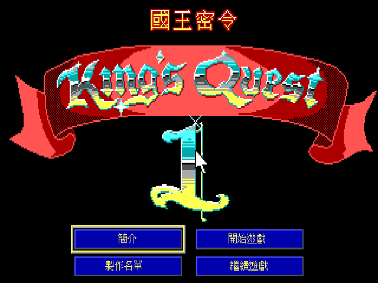
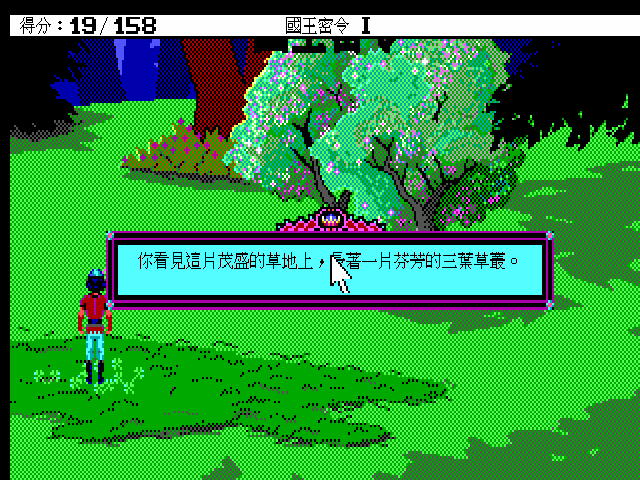
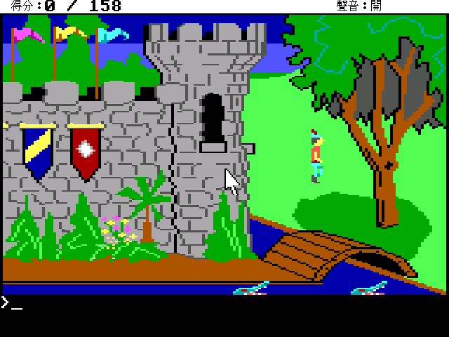
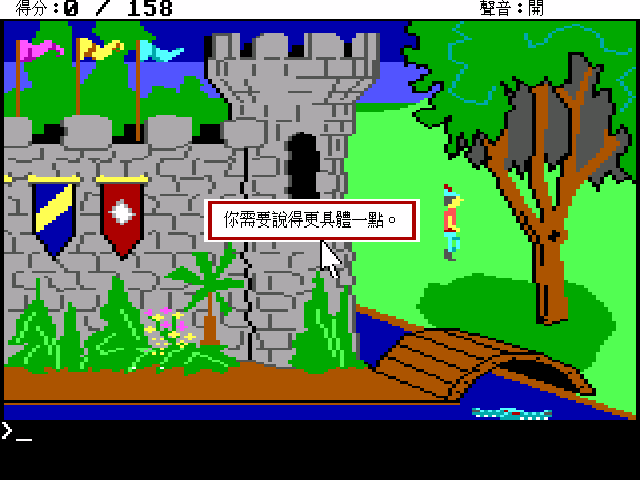

# 國王密令 King's Quest I — 繁體中文化

Sierra 1984 年的《King's Quest》是圖形冒險遊戲的開山之作：在那之前，冒險遊戲是純文字的，
玩家讀敘述、打指令；KQ1 讓玩家第一次「看著自己的角色」在會遮擋、有前後景的立體場景裡走動。
這個專案把它的兩個 DOS 版本都做成繁體中文：**1984/1987 的 AGI 原版**，以及 **1990 年
Sierra 用 SCI 引擎重製的版本**。

台灣玩家對這款遊戲的記憶，多半來自**第三波資訊文化事業**代理的盒裝版，編號 PC22，
官方譯名就叫**《國王密令》**（副標「國王密使」）。本專案的人名、地名、道具名全部沿用那本
中文說明書，而不是後來智冠版《國王密使》系列的譯法——所以這裡的主角是**格拉漢爵士**，
國度叫**戴凡確王國**，三件寶物是**魔鏡、靈盾、金盒子**。

說明書全文整理在 [`manual_cht/README.md`](manual_cht/README.md)，含當年的故事背景、
操作方式、物品與動作指令對照表。

## 畫面

| 1990 SCI 重製版 | |
|---|---|
|  |  |
| 中文標題疊在原版 logo 上方，不動原始美術 | 對白用倚天點陣字 |

| 1984/1987 AGI 原版 | |
|---|---|
|  |  |
| 狀態列、得分、音效開關都中文化 | 640×400 畫布下的中文對白 |

## 兩個版本都能玩

一個包裡同時有兩個遊戲項目，啟動後從 ScummVM 的遊戲清單挑：

- **kq1agi** — 1984/1987 AGI 原版（ScummVM 偵測為 `agi:kq1`，2.0F）
- **kq1sci** — 1990 SCI 重製版（ScummVM 偵測為 `sci:kq1sci`，SCI0 EGA）

兩版是同一個故事，但 1990 版把文字**重寫過**，不是單純換皮：正規化比對後只有 20% 的句子
一字不差，所以兩軌的譯文是各自翻的，只有譯名與語感共用同一套規範。

## 安裝

### patch 版（玩家自備遊戲）

適用於已經有正版遊戲檔的人。解開後執行啟動器，第一次要在 ScummVM 的「遊戲選項 → 路徑」
指到你自己的遊戲資料夾（AGI 版指到含 `LOGDIR`/`VOL.0` 的目錄，SCI 版指到含
`RESOURCE.MAP`/`RESOURCE.001` 的目錄）。

- Linux：`KQ1-CHT-patch-x86_64.AppImage`
- Windows：`KQ1-CHT-patch-win64.zip`（解開後跑 `.bat`）
- macOS：`KQ1-CHT-patch-macos-universal.dmg` 或 `.tar.gz`（universal，arm64 + x86_64）

macOS 首次執行要先解除隔離：`xattr -dr com.apple.quarantine <路徑>/ScummVM.app`，
中文資料在 `ScummVM.app/Contents/Resources/cht-data`（加入遊戲後把它設成「額外路徑」）。

patch 版**不含任何遊戲資源**，只有中文化過的 ScummVM 引擎 + 中文資料（譯文表、字型、
標題疊圖）。

### MT-32 音樂

引擎編進了 Munt（MT-32 模擬器）。1990 SCI 版原生附 `MT32.DRV`，用 Roland MT-32 音色跑
比 AdLib 好聽很多。patch 版不附 ROM（有版權），你需要自備 `MT32_CONTROL.ROM` 與
`MT32_PCM.ROM` 放進遊戲資料夾，再到音效選項選 Roland MT-32。

## 中文化是怎麼做的

不解壓、不改寫、也不散布原始遊戲資源。做法是**在引擎繪字的咽喉點做內容比對替換**：
拿英文原文當 key 去查外部的 `translation.tsv`，命中就換成 Big5 譯文再畫。於是交付物只有
「引擎 patch + 譯文表 + 字型」，原始資源一個位元組都沒動。

- **字形用倚天中文系統（ETEN）的原生點陣字**，不是把 TTF 縮小。1990 年代 DOS 中文長什麼樣，
  倚天就長什麼樣；TTF 縮到 15px 筆劃比例會跑掉、複雜字糊成一團。漢字取自 `STDFONT.15`
  （16×15），全形標點取自 `SPCFONT.15`（少了它，`，。！？「」` 會整批掉到別的字型）。
- **文字來源不只對白**：SCI 軌除了 `text`/`message` 資源，還有內嵌在 `script` 裡的道具描述、
  `script.997` 的選單字串；AGI 軌則是 LOGIC 訊息（`Avis Durgan` 循環 XOR 加密）加上
  `OBJECT` 檔裡的道具名。全部加起來雙軌共 3018 則，覆蓋率 98%。
- **中文標題**用索引點陣疊圖畫在原版 logo 上方，不覆蓋經典英文字樣。兩軌各一份
  （SCI 疊在 1990 版標題畫面的 logo 上方、AGI 疊在 1987 版的 KING'S QUEST 橫幅上方），
  格式與座標系不同，分別由 `build_title_overlay.py` / `build_title_overlay_agi.py` 產生。
- **F8 可以隨時切回英文原文**，再按一次切回中文——想對照 1990 年的原句時很方便。
  AGI 版是當前訊息框就地重繪，SCI 版是下一句生效（SCI 的文字框與 port 狀態綁得太緊，
  就地重繪風險高）。

### 修掉的兩個引擎級問題

1. **中文按鈕固定少一個字**（「簡介」只顯示「簡」、「開始遊戲」只顯示「開始遊」）。
   SCI0 沿襲原版直譯器的一個 quirk：一段沒有空格的文字若「剛好」填滿一行就提早斷行。
   英文只有單字中間會沒有空格，幾乎踩不到；中文整句沒有空格，而遊戲又是照量到的文字寬度
   去開控制項——「剛好填滿」變成常態，於是每個控制項都被吃掉最後一個字。
2. **狀態列的中文變成亂碼**。SCI 狀態列是逐位元組畫的，Big5 的兩個位元組會被當成兩個拉丁
   字母，「分數：0／158」畫出來像 `G0 0158`。合併雙位元組後就正常了。

## 已知限制

- **SCI 版的狀態列（Score / 遊戲名）保持英文**。SCI0 的狀態列高度由遊戲寫死（10 列），
  16×15 的中文字放不進去；而讓中文變小需要的 640×400 內部升解析，KQ1 的狀態列繪製又
  撐不住（開了之後連英文都會破圖）。AGI 版沒有這個限制，狀態列是完整中文。
- 遊戲的 parser 只認英文指令。說明書那份中英動作對照表就是為此保留的，遊戲內提到
  `OPEN DOOR`、`USE THE SLINGSHOT` 這類要玩家打的字，譯文一律保留原文。

## 授權與致謝

- 中文化資料與引擎修改：依 ScummVM 的 GPLv3 釋出。
- 遊戲本身版權屬原作者／發行商，本專案不散布遊戲資源。
- 譯名與說明書內容出自第三波資訊文化事業《國王密令》PC22 中文說明書。
- 中文字形取自倚天中文系統點陣字。
- 建構於 [ScummVM](https://www.scummvm.org/)。
